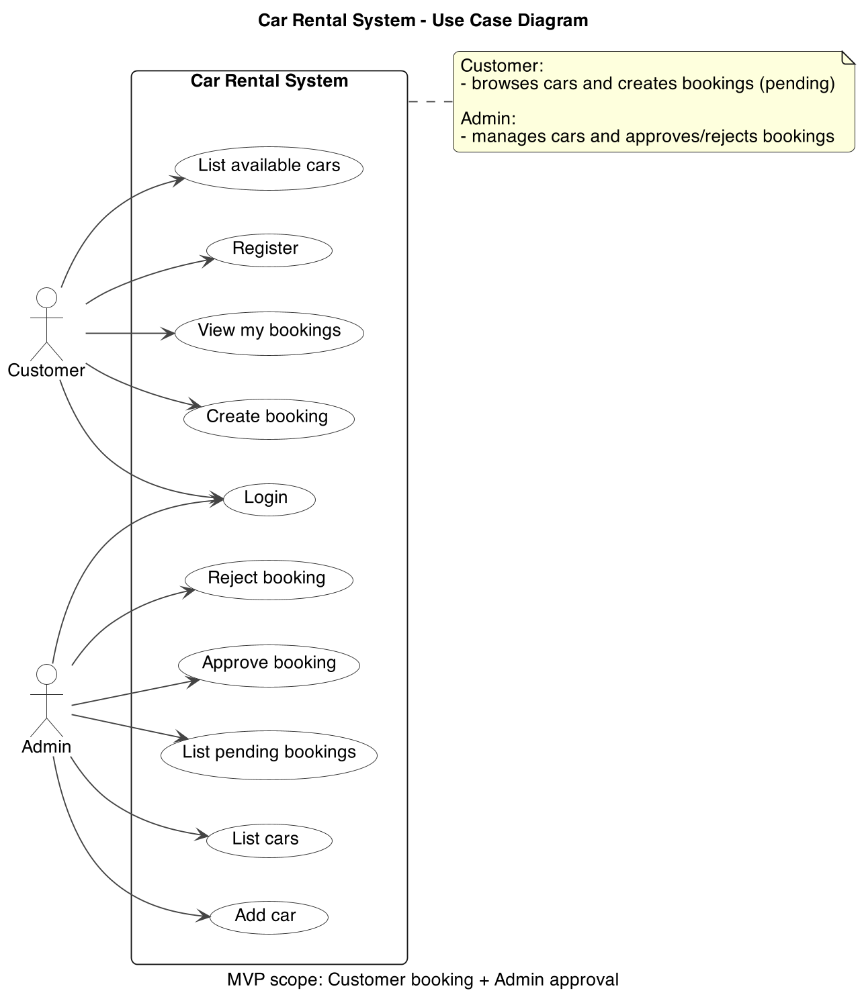
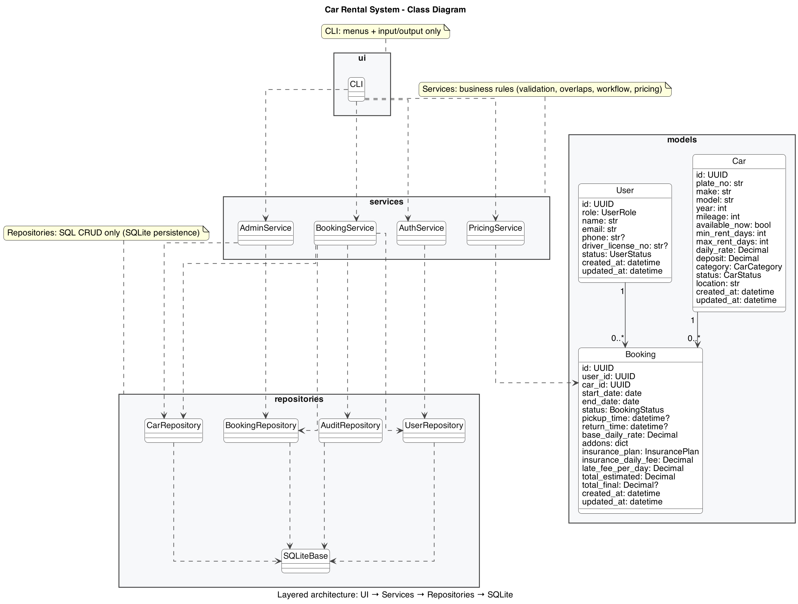
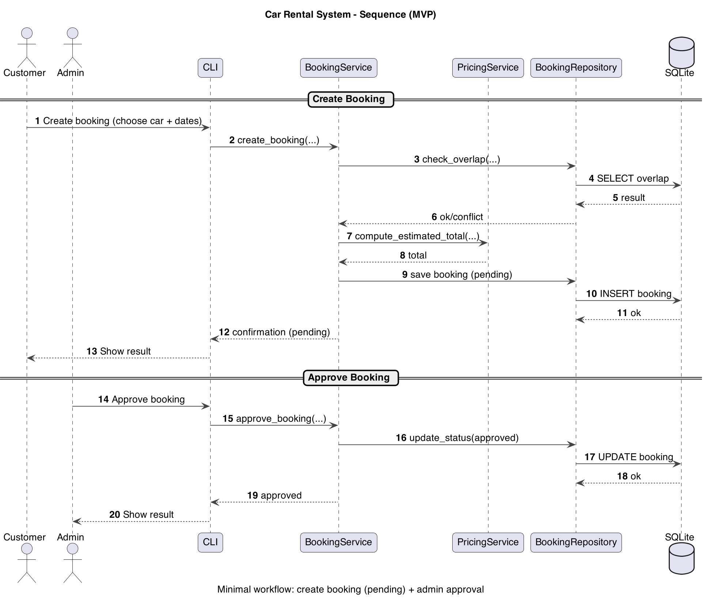

# Design & Architecture Report — Car Rental System (CLI MVP)

## 1. What I built (plain words)
I built a small Car Rental System that runs in a command-line interface (CLI). I intentionally focused on a minimum viable product (MVP) so the core workflow is complete and easy to demonstrate:

- Customers can register, log in, browse available cars, create bookings, and view their own bookings.
- Admins can add/manage cars and approve or reject booking requests.

The system uses a layered structure so the code is easier to understand, debug, and maintain.

## 2. How I interpreted the assignment requirements
The assignment requires role separation, car data fields, a booking flow with admin approval, pricing, and system documentation (UML). I translated these requirements into implementation tasks and mapped them to where they appear in the project.

### 2.1 Requirements mapping (requirement -> where it is implemented)

- **Role separation (customer/admin):** `User.role` + CLI menus + service-level checks
- **Customer can browse cars and create bookings:** CLI **List available cars** + `BookingService.create_booking()`
- **Admin can manage cars:** CLI **Add car / List cars** + `AdminService` + `CarRepository`
- **Admin can approve/reject bookings:** CLI **Pending bookings** + `BookingService.approve_booking()` / `reject_booking()`
- **Car data includes required attributes:** `Car` model + SQLite schema fields
- **Pricing based on rental and extra fees:** `PricingService.compute_estimated_total()` (base + add-ons + insurance)
- **Prevent invalid bookings / conflicts:** Service validation + overlap check in `BookingRepository.check_overlap()`
- **Documentation with UML diagrams:** Use Case / Class / Sequence diagrams included below

**Required car fields (explicitly included):**
Each car record includes **ID, make, model, year, mileage, available_now, min_rent_days, and max_rent_days**.

## 3. Architecture overview (layers and responsibilities)
I split the project into four layers: models -> repositories -> services -> UI.

- Models define the data shape (User, Car, Booking) and basic validation (types/ranges).
- Repositories contain SQL CRUD only (read/write SQLite). They do not decide business rules.
- Services enforce business rules (rental limits, overlap rules, approval workflow, pricing).
- CLI (UI) only handles user input/output (menus, prompts, formatted results).

I chose this layered approach because it separates responsibilities clearly:

- If something is not saved correctly, the issue is likely in the repository layer.
- If booking acceptance/rejection is wrong, the issue is likely in service rules.
- If interaction is confusing, it is the CLI layer.

This also makes the system easier to extend later (e.g., replace CLI with a web UI without rewriting business rules).

## 4. Key design decisions (what I chose and why)

- SQLite for persistence: Lightweight and easy to submit (no server required).
- Fixed database path: Prevents accidentally creating multiple databases when running from different folders.
- Decimal for money: Avoids floating-point rounding errors in price totals.
- Pricing snapshot in booking: base_daily_rate and add-ons are stored in the booking so historical bookings remain consistent even if car rates change later.
- Overlap prevention: The booking repository checks date overlap for the same car to prevent double-booking (e.g., for approved/active/overdue bookings).
- Business rules live in services: Repositories only handle data access; services decide whether an operation is allowed.
- CLI usability: Numbered selections are used instead of forcing users to type UUIDs, reducing input mistakes and improving demo flow.
- MVP scope control: Payment/refund integration is intentionally out of scope so the booking workflow stays clear and testable.

## 5. System documentation (UML)
The following UML diagrams are included as PNG and stored in docs/uml/.

### 5.1 Use Case Diagram

This diagram shows the two actors (Customer and Admin) and what each actor can do. It matches the implemented CLI features and keeps the scope limited to the MVP workflow. I kept it focused so it mirrors the menu options used in the CLI.

### 5.2 Class Diagram

This diagram shows the main models (User, Car, Booking) and the layered dependencies: CLI -> Services -> Repositories -> SQLite. It reflects how responsibilities are separated in the implementation. The relationships highlight how data models are used by repositories and services.

### 5.3 Sequence Diagram (Booking Flow)

This diagram describes the core workflow: customer creates a booking request (pending), the service validates and checks overlap, pricing is calculated, and the admin approves or rejects. It lines up with the actual service calls used in the CLI flow, which is the main scenario for marking.

## 6. Core workflow walkthrough (in words)

### 6.1 Create booking (customer)
Customer selects a car and enters a rental date range (or rental days) in the CLI.

BookingService.create_booking() validates:

- rental days within global limits and within the car's min/max days,
- car is active/available,
- no overlapping booking exists for the same car in the same period.

PricingService calculates the estimated total (base + add-ons + insurance).

The booking is stored with status pending.

**Example (pricing calculation):**
If a customer books 2026-01-26 to 2026-01-28 (2 days) with daily rate $55/day:

- Base fee = 2 x 55 = $110
- If add-ons total $5/day and insurance is $0/day, add-ons fee = 2 x 5 = $10
- Estimated total = 110 + 10 + 0 = $120

### 6.2 Approve booking (admin)
Admin views pending bookings in the CLI.

BookingService.approve_booking() re-checks overlap (helps prevent conflicts caused by concurrency).

If valid, status becomes approved; otherwise it is rejected and the reason can be logged (audit).

This create -> approve flow is the main scenario used for demonstration and marking.

## 7. Deliverables and how to submit
The submission package includes:

- Source code folder: src/
- README (user guide + demo script): README.md
- Design & Architecture report: export this file (docs/Design_Report.md) to PDF
- UML diagrams PDF: combine UML PNGs in docs/uml/ into one PDF (e.g., docs/uml/UML_Diagrams.pdf)
- Maintenance & Support report: export docs/maintenance.md to PDF
- Release build zip: a zip that contains runnable project files (CLI entry + required files)

## 8. What is implemented now (MVP)

- Customer: register, login, list available cars, create booking, view bookings.
- Admin: login, add cars, list cars, list pending bookings, approve/reject bookings.
- Booking validation: rental day limits + overlap checks.
- Pricing: estimated total from base + add-ons + insurance.

## 9. Limitations and future improvements

- Email-only login (no password system).
- No payment or refund workflow.
- Optional improvements: more automated tests, cancellation/late fees, reporting/export features.
